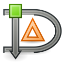

# Dia

## About

Dia is a program for drawing diagrams, and is Free Software.

General documentation can be found in the [doc/](doc/) directory.

If you are thinking of contributing (either code or diagrams), please see
[HACKING.md](HACKING.md).

For compilation and installation instructions please see [BUILDING.md](BUILDING.md).

Upstream Repository: https://gitlab.gnome.org/GNOME/Dia

## Bug reporting

Report bugs in GitLab https://gitlab.gnome.org/GNOME/dia/issues, check existing issues (open and closed) to check if your bug isn't already known (or indeed fixed!)

If the issue is not there, please report it.  Otherwise, give it a "thumbs-up".
This will us prioritise them.

## Use of Generative AI

*[Adopted from Loupe](https://gitlab.gnome.org/GNOME/loupe)*

This project does not allow contributions generated by large languages models
(LLMs) and chatbots. This ban includes tools like ChatGPT, Ollama, Claude,
Copilot, DeepSeek, and Devin AI. We are taking these steps as precaution due
to the potential negative influence of AI generated content on quality, as
well as likely copyright violations.

This ban of AI generated content applies to all parts of the projects, including, but not limited to, code, documentation, issues, and artworks. An exception applies for purely translating texts for issues and comments to English.

AI tools can be used to answer questions and find information. However, we encourage contributors to avoid them in favor of using [existing documentation](https://developer.gnome.org) and our [chats and forums](https://welcome.gnome.org). Since AI generated information is frequently misleading or false, we cannot supply support on anything referencing AI output.

## Contacting us

It's always nice to hear from people still using Dia!

Please feel free to share comments/feedback/questions [on Discourse](https://discourse.gnome.org/tags/c/applications/7/dia), or you can join the matrix channel  [`#dia-editor:gnome.org`](https://matrix.to/#/#dia-editor:gnome.org).

## Help Wanted

There is a lot of work to be done in order to bring Dia up to date.  Part of
the reason why Dia has been around for so long is that it is very stable.
We intend to keep it that way.

### General contributions

We would love to have more people on-board helping improve Dia.  For that,
the only requirement is patience :slight_smile:.  Software quality comes not
from the code itself, but how people develop that code.  As such, we need to
be very nitpicky with what we accept into master and _when_.

Do not be offended: we aren't trying to be mean, control-freaks or in any way
belittle your work, it's simply that good things take time and there's no way
to rush quality.  With that in mind, we welcome all contributions, no matter
how tiny so please get in touch.

### Windows build maintainer

We currently need somebody to look after the Windows builds and packages.
Most of us use Linux as our main operating system, so if you use Windows and
would like to program on Dia on Windows, for example, getting it running on
Visual Studio + Meson, please get in touch.  Note that this involves doing
full development on Windows and is not limited to just getting it to compile.

### MacOS build maintainer

Similarly to the above, we need somebody to ensure Dia builds and runs well
on macOS.

### Translators &amp; Documentation writers

Dia is translated over at l10n.gnome.org (module: [dia](https://l10n.gnome.org/module/dia/)), please submit translations there instead of as merge requests

Much of the documentation in doc/ is outdated.  We need somebody to go through
the documents, check what is good, update them and then maintain them.  If you
enjoy or want to practice technical writing or would be interested in helping
with the translation we would love to hear from you!

Ideally the docs would be rewritten in Mallard instead of Docbook

### Testers

One simple way to ensure Dia works well for everybody is to test it on as many
machines as possible.  This role is simple and is a very good way to get more
familiar with the Dia codebase.  Plus, the more people Dia works for from
source, the easier it is for package maintainers and the easier it is for
anybody to contribute patches:

  1. Obtain a machine (ARM, ARM64, x86\_64, SPARC, doesn't matter) in one or more
of the following ways:
  2. Local laptop, desktop, etc
  3. Premade box from https://www.osboxes.org/ or similar
  4. Install a virtual machine from ISO
  5. Follow the compilation & installation instructions for Dia
  6. See if you can get all the features of Dia running.
  7. Try various meson options: https://mesonbuild.com/Configuring-a-build-directory.html
  8. Try to install dependencies in a different order.
  9. Try a different compiler
  10. If anything is off and hasn't been reported before, let us know!  If it has
been reported, give the issue a "+1".
  11. If you've tried your best and haven't found anything wrong, also give us a
shout :-) Let us know what you tried and why you think there aren't any issues
on the machine you tested it on.
